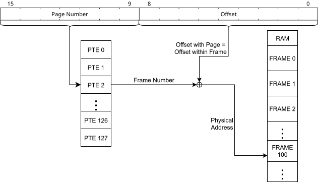
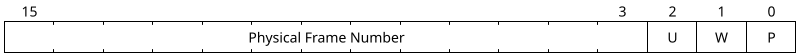
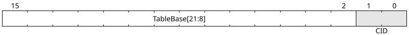
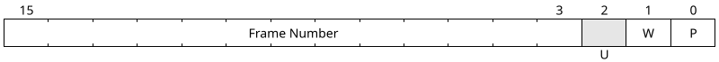
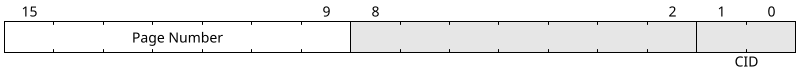

# General Design

**Extension State: Under Development**  
**Requires: CP1.2**  
**CPUID Bit: CP1.13**

# Overview

This extension adds a 16-bit protected addressing mode to the ISA.
In particular, this extension focuses on the _Virtual 16-bit address mode_.

# Virtual 16-bit address mode

The new mode is indicated by `MODE[PTRSZ]=0`, `MODE[VM]=1.`

Refer to the [Mode Control Register](../mode-control-register.md#virtual-address-modes)
for a detailed generic description of virtual address modes.

# Mode Characteristics

The 16-bit virtual address space is divided up into 128 x 512 byte pages,
corresponding to 7 bits for the page number and 9 for the page offset.
The page tables are single-level page tables.

## Hard Paging

Each page table entry is 2 bytes, for a total table size of 256 bytes,
or half a page. Each page table must be 256-byte aligned in memory.

The single-level paging address translation looks as follows.

When [CIDE](../../features/context-identifiers/) are supported,
the mode supports the use of up to 4 context identifiers.
(Also see the [paging documentation](../mode-control-register.md#optional-feature-cid).)

### Page Table Entries

Each page table entry has the following format.

| Bitfield Name | Bits | Description |
|:-------------:|:----:|:------------|
| `P`           | 0    | When cleared, the page is not present and all other bits are ignored. |
| `W`           | 1    | 1 if the page is writable, 0 if it is read-only. |
| `U`           | 2    | 1 if the page is accessible in User mode. This bit is **reserved** if [`PM`](../privileged-mode/) is not available. |
| `Frame Number` | 3-15 | The frame number this page is mapped to. |

The base physical address of a frame is its frame number shifted left by 9 bits. Therefore,
given a 22-bit physical address `PhysAddr`, the `Frame Number` field stores
`PhysAddr[21:9]`.

### `VM_ROOT` Format

The two least significant bits of `VM_ROOT` must be zero unless
[context identifiers](../../features/context-identifiers/) are
both supported and enabled (`MODE[CID]=1`).
If context identifiers are enabled, the two least significant bits
store the 2-bit current CID.

the `TableBase` field stores the 14 most significant physical address
bits of the page table. This is one more physical address bit than
is supported for frame numbers, corresponding to the fact that
page tables consume half a frame each. This enables software to
store two page tables per frame if desired.

## Soft TLB Entry Format

When using soft paging, `TLBLO` and `TLBHI` (CRs 21 and 22) are 16-bit registers.

`TLBLO`:

`TLBHI`:

The corresponding TLB entry maps the page with the page number
in `TLBHI` to the frame with frame number in `TLBLO`.

As with page table entries, the `U` bit is reserved unless `PM` is available.
As with `VM_ROOT`, the `CID` field is reserved unless
context identifiers are supported. Unlike `VM_ROOT`,
writing a non-zero `CID` to a TLB entry is **permitted**
whenever context identifiers are supported, even while `MODE[CID]=0`.
The entry won't be used for translations until `MODE[CID]` is set.
While `MODE[CID]=1`, the "current CID" is controlled by the
`VM_ROOT[CID]` bits (even though soft paging ignores the rest of `VM_ROOT`).

> [!TIP]
> For software developers: while the TLB entries do not contain accessed/dirty
> bits, it is possible to emulate them. Periodically clear the `P` and `W` bits
> of your TLB entries, recording elsewhere (e.g., your custom paging structure),
> which entries are valid and which are writable. Optionally record the values
> of the bits before clearing them, to keep a history.
> When handling `#PF(P)` and `#PF(W)`, first check in your records if the
> necessary TLB entry is already allocated with storage attributes cleared.
> If so, simply set the appropriate attribute bits and return from handler.
> Now the `P` and `W` bits of your entries also function as `A` and `D` bits.
>
> Be careful to never clear the `P` bit on the entry mapping the
> exception handler!

# Additional Behavioral Changes

In Virtual 16-bit Address Mode, support for [global pages](../mode-control-register.md#optional-feature-global-pages)
must be **ignored**. This mode has no way to configure global
pages, but conditions relaxed by the global pages feature
would allow a soft TLB to invalidate TLB entries whose presence
is required to avoid a double fault.
Therefore, in this mode, those conditions are not relaxed.
Processors wishing to offer a more efficient invalidation strategy
should support [context identifiers](../mode-control-register.md#optional-feature-cid) instead.

An implementation supporting Virtual 16-bit Address Mode _and_
another virtual addressing extension is still permitted to
support global pages and the associated relaxed invalidation
rules in the other virtual addressing mode(s).

# Interaction with Other Extensions

When [cache instructions](../cache-instructions/) is present, the uncacheable
address ranges specified in its control registers denote _physical_ addresses.
