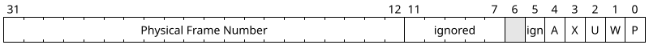
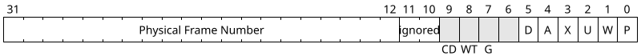
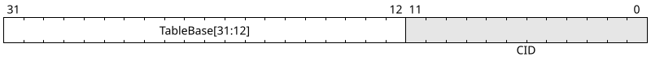
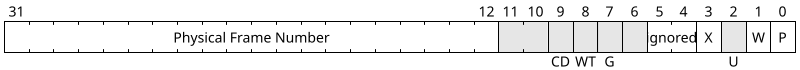
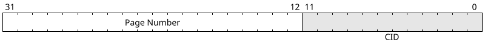

# General Design

**Extension State: Under Development**  
**Requires: CP1.2**  
**CPUID Bit: CP1.17**

# Overview

This extension adds a 32-bit protected addressing mode to the ISA.
In particular, this extension focuses on the _Virtual 32-bit address mode_.

# Virtual 32-bit address mode

The new mode is indicated by `MODE[PTRSZ]=1`, `MODE[VM]=1.`

Refer to the [Mode Control Register](../addressing-modes.md#virtual-address-modes)
for a detailed generic description of virtual address modes.

# Mode Characteristics

The 32-bit virtual address space is divided up into 2^20 pages of size
4KiB each, corresponding to 20 bits for the page number and 12 for the
page offset.

## Hard Paging

For hard paging, the page tables are two-level page tables,
with 10 bits for each index. `VM_ROOT` points to a page directory.

Each page directory entry is 4 bytes and there are 1024 entries per directory,
so each page directory is 4KiB in size -- exactly one per frame.
Each entry contains, among other things, a 20-bit physical frame number
(the 20 most-significant bits of physical addreses within that frame).
The frame indicated by a page directory entry contains a page table,
which also contains 1024 4-byte entries. The frames indicated by each
page table entry contain the mapped pages.

Page directories and page tables must be 4KiB-aligned in memory.

The two-level paging address translation looks as follows.

When [CIDs](../addressing-modes.md#optional-feature-cid) are supported,
the mode supports the use of up to 4096 context identifiers.

### Page Directory (PDL1) Entries

Each page directory entry has the following format.

| Bitfield Name | Bits | Description |
|:-------------:|:----:|:------------|
| `P`           | 0    | When cleared, the page table is not present and all other bits are ignored. |
| `W`           | 1    | 1 if the page is writable, 0 if it is read-only. |
| `U`           | 2    | 1 if the page is accessible in User mode. This bit is **reserved** if [`PM`](../privileged-mode/) is not available. |
| `X`           | 3    | 1 if the page is accessible by instruction fetches. |
| `A`           | 4    | In hard paging modes, set **by hardware** when this entry is used in a translation. |
| ign(ored)     | 5,7-11 | These bits are free for software use. |
| reserved      | 6    | This bit is reserved for "huge paging" and must be zero. |
| Frame Number | 12-31 | The frame number of the frame containing the indicated page table. |

The base physical address of a frame is its frame number shifted left by 12 bits.
Conveniently, the Frame Number field begins at bit 12, so no shifting is necessary
to insert the physical address of a frame into a page table entry.

### Page Table Entries

Each page table entry has the following format.

| Bitfield Name | Bits | Description |
|:-------------:|:----:|:------------|
| `P`           | 0    | When cleared, the page table is not present and all other bits are ignored. |
| `W`           | 1    | 1 if the page is writable, 0 if it is read-only. |
| `U`           | 2    | 1 if the page is accessible in User mode. This bit is **reserved** if [`PM`](../privileged-mode/) is not available. |
| `X`           | 3    | 1 if the page is accessible by instruction fetches. |
| `A`           | 4    | Set **by hardware** when this entry is used in a translation. |
| `D`           | 5    | Set **by hardware** when this entry is used to translate a write access. |
| reserved      | 6    | This bit must be zero. | 
| `G`           | 7    | 1 if the page is global. This bit is reserved unless the implementation has [global pages enabled](../../features/page-global-enabled/). |
| reserved      | 8    | This bit is reserved for a future extension allowing pages to be marked write-through for caching purposes. |
| `CD`          | 9    | 1 if accesses to this page must not be cached. This bit is reserved unless [Cache Instructions](../cache-instructions/) is present. |
| ign(ored)     | 10-11 | These bits are free for software use. |
| Frame Number | 12-31 | The frame number of the frame containing the indicated page. |

### `VM_ROOT` Format

The twelve least significant bits of `VM_ROOT` must be zero unless
[context identifiers](../addressing-modes.md#optional-feature-cid) are
both supported and enabled (`MODE[CID]=1`).
If context identifiers are enabled, the twelve least significant bits
store the 12-bit current CID.

the `TableBase` field stores the 20 most significant physical address
bits of the page directory, equivalently, the frame number of the
physical frame in which the page directory resides.

## Soft TLB Entry Format

When using soft paging, `TLBLO` and `TLBHI` (CRs 21 and 22) are 32-bit registers.

`TLBLO`:

`TLBHI`:

The corresponding TLB entry maps the page with the page number
in `TLBHI` to the frame with frame number in `TLBLO`.

As with page table entries, the `U` bit is reserved unless `PM` is available
and the `G` bit is reserved unless global pages are supported.
As with `VM_ROOT`, the `CID` field is reserved unless
context identifiers are supported. Like `VM_ROOT`,
writing a non-zero `CID` to a TLB entry is not allowed
while `MODE[CID]=0`.
While `MODE[CID]=1`, the "current CID" is controlled by the
`VM_ROOT[CID]` bits (even though soft paging ignores the rest of `VM_ROOT`).

## Accessed and Dirty Bits

Page directories, page tables, and soft TLB entries all have bits labeled `A`,
known as "accessed" bits.
Page tables and soft TLB entries additionally have a bit labeled `D`,
known as a "dirty" bit. These flags are useful for memory management software
to track which pages are being frequently used and which frames can be
unmapped without having to save their contents elsewhere. Both of these
properties are frequently used to manage the transfer of pages in and
out of physical memory.

When a paging structure entry is used successfully in a translation,
even if a later stage causes a `#PF`, hardware sets the `A` bit of the structure.
This write occurs as part of the instruction that caused the
original memory access and is visible to the following instruction.

Software can read out and clear `A` bits periodically.
For hard paging, if the software cares about accurate `A` bit accounting,
it must invalidate a page in the mapped region of the relevant entry.
This will also invalidate any cached copies of the page directory.
Failure to invalidate such a page may result in hardware not setting
the `A` bit on the next several accesses, possibly until such a page
is invalidated.
For soft paging, clearing the `A` bit in the TLB entry is sufficient.

The `D` bit behaves like the `A` bit, except that hardware only
sets it on successful _write_ accesses, and the bit is only present
in structures that map pages (as opposed to other paging structures).
Currently, this means the bit is only present on page table entries.

# Interaction with Other Extensions

When [cache instructions](../cache-instructions/) is present, the uncacheable
address ranges specified in its control registers denote _physical_ addresses.

A page with `CD=0` but mapped to a frame in the uncacheable region must
not be cached. A page with `CD=1` mapped to a frame in a cacheable region
must not be cached either.
