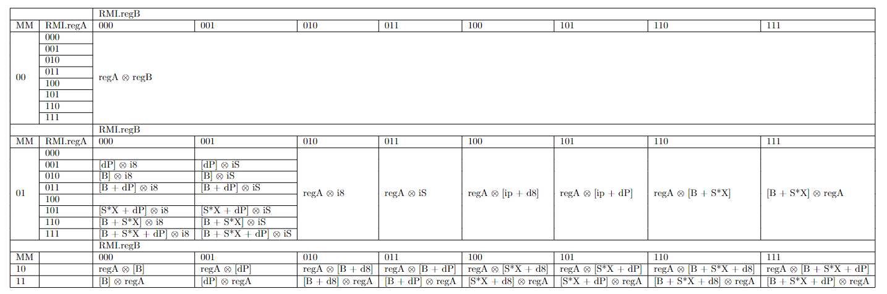

# General design

**Extension State: Under Development**  
**Enabled by Default: Yes**  
**Requires: Base, VWI**  
**CPUID Bit: CP1.0**

# Overview

This extension offers an encoding for immediate values larger than 5 bits.

# Added Instructions

In Base ETCa, the second byte, or "ABM byte" takes this format:
```
+-----+-----+----+
| AAA | BBB | MM |
+-----+-----+----+
```

Only `MM=00` is defined by base. This extension applies to any instruction which uses an ABM byte.

The following ABM byte values are added:

| ABM | Following Bytes | Meaning |
|-----|-----------------|---------|
| <pre>+-----+-----+----+<br>\| AAA \| 010 \| 01 \|<br>+-----+-----+----+</pre> | `i8` | The instruction is followed by a 1-byte immediate |
| <pre>+-----+-----+----+<br>\| AAA \| 011 \| 01 \|<br>+-----+-----+----+</pre> | `iS` | The instruction is followed by a "sized" immediate, as explained below |

An `i8` is always a 1-byte literal value. An `iS` is a flexibly-sized immediate value. The size is determined
according to the operand size (usually, determined by the `SS` bits of the instruction) according to
the following table:

| SS | Number of Bytes in iS |
|----|-----------------------|
| 00 | 1 |
| 01 | 2 |
| 10 | 4 |
| 11 | 4 |

An 8-byte literal immediate cannot be encoded by this extension. However, any encoding
which "modifies the meaning of `iS`" will affect the `iS` immediate defined here.

If the [register expansion](../expanded-registers/README.md) extension is available, then the `REX.Q` prefix can be used with instructions from this
extension. It has an effect only if both of the following conditions are met:
  - The instruction is an `iS` mode
  - The instruction's Operand Size attribute is `quad`
Then the immediate is an 8-byte literal value instead of a 4-byte literal value. In other cases, `REX.Q` remains reserved.

The added instructions can be seen in the complete Advanced Operand Extensions table, which encompasses the FI, MO1, and MO2 extensions. They are under `Mode=01`, `ABM.regB = 01x`.

