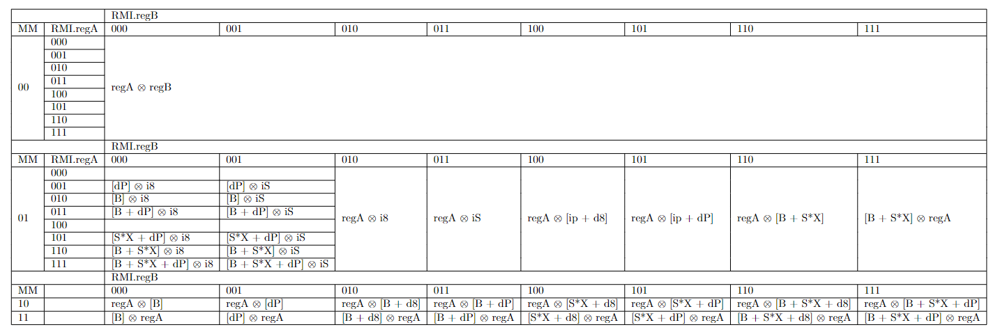

# General design

**Extension State: Under Development**

**Enabled by Default: Yes**

**Requires: Base, VWI**

**CPUID Bit: 13**

# Overview

This extension adds additional memory operand modes, which are independent from those described by [MO1](../memory-operands-1/README.md).
Familiarity with MO1 is encouraged for reading this document. However, MO1 and MO2 are independent. MO2 does not require MO1.
Familiarity with the full-immediates extension is encouraged likewise.

# Added Instruction Formats

| `ABM` | Followed By 1 | Followed By 2 | Followed By 3 |Specified First Operand | Specified Second Operand |
|-------|---------------|---------------|-----------|--|--|
|<pre>+-----+-----+----+ \| 001 \| 000 \| 01 \| +-----+-----+----+</pre> | `dP` | `i8` | | `[dP]` | `i8`
|<pre>+-----+-----+----+ \| 010 \| 000 \| 01 \| +-----+-----+----+</pre> | `SIB` | `i8` | | `[SIB.B]` | `i8`
|<pre>+-----+-----+----+ \| 011 \| 000 \| 01 \| +-----+-----+----+</pre> | `SIB` | `dP` | `i8` | `[SIB.B + dP]` | `i8`
|<pre>+-----+-----+----+ \| 101 \| 000 \| 01 \| +-----+-----+----+</pre> | `SIB` | `dP` | `i8` | `[2^SIB.S * SIB.X + dP]` | `i8`
|<pre>+-----+-----+----+ \| 110 \| 000 \| 01 \| +-----+-----+----+</pre> | `SIB` | `i8` | | `[2^SIB.S * SIB.X + SIB.B]` | `i8`
|<pre>+-----+-----+----+ \| 111 \| 000 \| 01 \| +-----+-----+----+</pre> | `SIB` | `dP` | `i8` | `[2^SIB.S * SIB.X + SIB.B + dP]` | `i8`
|<pre>+-----+-----+----+ \| 001 \| 001 \| 01 \| +-----+-----+----+</pre> | `dP` | `iS` | | `[dP]` | `iS`
|<pre>+-----+-----+----+ \| 010 \| 001 \| 01 \| +-----+-----+----+</pre> | `SIB` | `iS` | | `[SIB.B]` | `iS`
|<pre>+-----+-----+----+ \| 011 \| 001 \| 01 \| +-----+-----+----+</pre> | `SIB` | `dP` | `iS` | `[SIB.B + dP]` | `iS`
|<pre>+-----+-----+----+ \| 101 \| 001 \| 01 \| +-----+-----+----+</pre> | `SIB` | `dP` | `iS` | `[2^SIB.S * SIB.X + dP]` | `iS`
|<pre>+-----+-----+----+ \| 110 \| 001 \| 01 \| +-----+-----+----+</pre> | `SIB` | `iS` | | `[2^SIB.S * SIB.X + SIB.B]` | `iS`
|<pre>+-----+-----+----+ \| 111 \| 001 \| 01 \| +-----+-----+----+</pre> | `SIB` | `dP` | `iS` | `[2^SIB.S * SIB.X + SIB.B + dP]` | `iS`
|<pre>+-----+-----+----+ \| AAA \| 100 \| 01 \| +-----+-----+----+</pre> | `d8`  |      |      | `A` | `[ip + d8]`
|<pre>+-----+-----+----+ \| AAA \| 101 \| 01 \| +-----+-----+----+</pre> | `dP`  |      |      | `A` | `[ip + dP]`
|<pre>+-----+-----+----+ \| AAA \| 110 \| 01 \| +-----+-----+----+</pre> | `SIB` | | | `A` | `[2^SIB.S * SIB.X + SIB.B]`
|<pre>+-----+-----+----+ \| AAA \| 111 \| 01 \| +-----+-----+----+</pre> | `SIB` | | | `[2^SIB.S * SIB.X + SIB.B]` | `A`

The value `ip` is the address in memory of the current instruction.

## `REX.Q`

A `REX.Q` prefix can be used with instructions in this format if all of the following conditions are met:
  - The instruction has _exactly one_ of a displacement or immediate. It cannot have both.
  - The instruction is an `iS` mode with Operand Size attribute `quad`
  - The instruction is a `dP` mode and the current Addressing Mode is `quad`
  - The [register expansion](../expanded-registers/README.md) extension is available
Then the `iS` or `dP` will be an 8-byte value rather than a 4-byte value.

The prefix remains illegal if any of the `REX.A`, `REX.B`, or `REX.X` bits are set and the register expansion extension is not enabled.
`REX.Q` is **illegal**, not reserved, for instructions in these formats which do not satisfy the above conditions.

In all other instruction formats, `REX.Q` remains reserved.

# Added Instruction

| Name | Encoding | Operands | Description |
|------|----------|----------|-------------|
| LEA r, m | `00SS1110` | `ABM` | Loads the address specified by the second operand into the register specified by the first. Note that the address _itself_ is stored in the register, not the contents of memory at that address. The result stored in the register must respect the operand size attribute. The computed address must respect the address mode.

`LEA` means "load effective address." If the first operand is not a register, or the second is not a memory location, the instruction must be treated as an
undefined instruction. Such cases are **not** reserved - they are explicitly undefined.

Note that LEA shares an opcode with `READCR` (aka `mfcr`). `LEA` has no immediate mode, and `READCR` has
no register-to-register mode.

`LEA` does not affect any CPU flags. In addition to its stated purpose, it can be used to perform some "complex" arithmetic such as
copy-and-add operations, in a single instruction and without affecting flags. For example, `LEA` can be used to
encode `rx2 ← r0 + 4 * r1 + 10` in one 4-byte instruction, as `1E 5A 88 0A`.

This same specification of `LEA` is described in [memory-operands-1](../memory-operands-1/README.md), but these extensions
are independent and can each coexist without the other. It is generally recommend, however, that a system supporting
MO2 also support MO1.

# AOE Table

The added instructions can be seen in the complete Advanced Operand Extensions table, which encompasses the FI, MO1, and MO2 extensions. They are under `Mode=01`, `ABM != 01x`.

