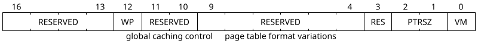
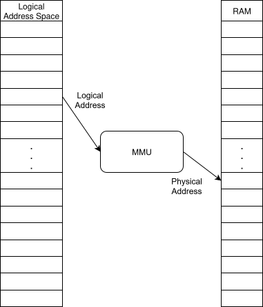
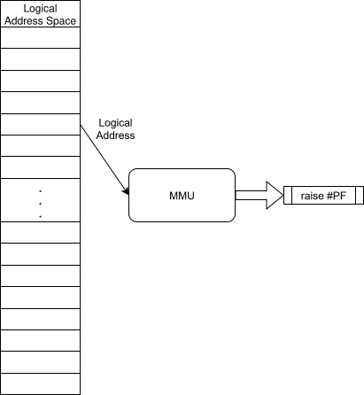
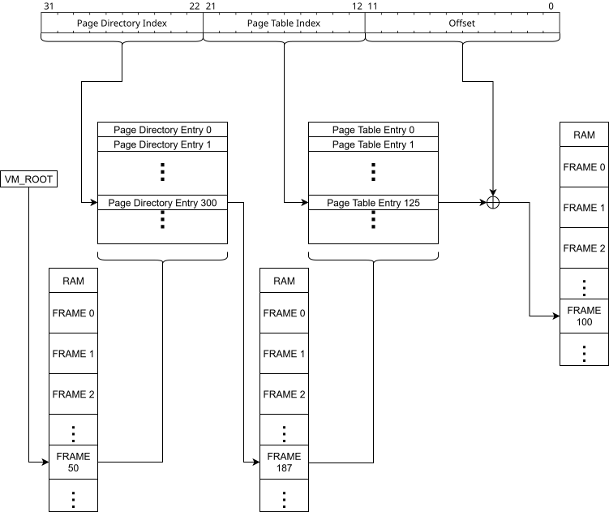

# Overview

This document describes the mode control register in a centralized location so that other extensions which use it can refer to a single document
instead of duplicating it between all relevant extensions. The mode control register adds a new concept of _modes_ to the ISA. Modes are used to
control things about the processor state which are binary-incompatible - that is, code written for a mode other than the mode the
processor is actually in will almost certainly behave incorrectly.

## Added Instructions

| Name   | First Byte  | Second Byte | Description  |
|--------|-------------|-------------|--------------|
| `INVLPG` | `1001 1111` | `AAA 001 00` | See [TLB Shootdown](#tlb-shootdown) below. |
| `INVLCID` | `1001 1111` | `AAA 001 01` | See [TLB Shootdown](#optional-feature-cid) below. |

# Modes

CR `1 0001`, equivalently `CR 17` or "the MODE control register," holds a value indicating the current
_mode_ of the processor.

The register contains a bit field with various bits controlling the behavior of address spaces.

| Bit | Name | Initial Value | Meaning |
|-----|------|---------------|---------|
| 0   | `VM` | `0` | When this bit is set, virtual memory is in use. Which extension specifically governs the addressing mode of the CPU depends on the other bits. |
| 1-2 | `PTRSZ` | `00` | These bits describe the width of logical addresses. `00` indicates 16 bits, `01` indicates 32, and `10` indicates 64. |
| 12  | `WP` | `1` | Short for "Write Protect," this bit controls the behavior of memory regions marked read-only. See below. |
| 13  | `CID` | `?` | When set, context identifiers other than 0 are allowed; see [TLB Shootdown, Optional Feature](#optional-feature-cid) below. |

All other bits are reserved for extensions, including bits above the 15th. Attempts to write these bits must raise `#GP`
unless the relevant extension is available.

When the `WP` bit is 0 and the [`PM`](../privileged-mode/) extension is available, in system mode any write access controls are ignored.
This allows system-privileged code to modify memory marked read-only for the user. When `WP` is 1, write access
controls are enforced even for privileged code.
When `PRIV` is not available, the `WP` bit controls the behavior of all code as if it were privileged.
Allowing privileged code to modify memory marked read-only is critical for implementing memory management software with
[16-bit Paging](16-bit-paging/README.md) or [32-bit Paging](32-bit-paging/README.md) enabled.

Note that `WP` only affects write protections described by "protected mode" extensions. Memory that is read-only for
some other reason, such as being mapped to a read-only device, remains read-only. However, enabling the `WP` protect
bit may cause an attempt to write such an address to trigger an exception rather than being silently ignored
(or worse, causing damage) which is helpful for finding kernel bugs. It is expected that software usually leave the bit
set, disabling it only for short periods of time when required.

### Related Control Registers

When `MODE[VM]=1`, the system additionally uses the R/W control registers CR 18 (`VM_ROOT`), CR 19 (`INT_PFLA`),
and possibly CRs 20-22 (`TLBX`, `TLBLO`, and `TLBHI`). The purpose of each of these registers is discussed [below](#soft-virtual-modes).
When `MODE[VM]=0`, reading or writing these registers has no immediate effect. All of these registers are
privileged, if `PM` is available.

Regardless of mode, attempting to write a reserved bit of any of
CR 17-22 must raise `#GP`. Note that the set of reserved
bits may change in the future, but that CPUID bits will ensure
it is possible to test for extension presence before writing a
CR bit that might fault.

# Base Mode (Real 16-bit Address Mode)

The mode described by [the base isa](../../base-isa.md) is known as the
Base mode. It is also known as Real 16-bit Address Mode.

In this mode, pointers are 16 bits and there is no virtual memory, paging, or memory protection.
Base mode is indicated by a value of 0 in `cr17`.

# Real n-bit Address Mode

In this mode, all addresses are treated as being `n` bits long. Addresses always refer to their sign extension to the highest supported address size.
Entering this mode from a smaller n-bit address mode _must_ preserve the program counter. Returning to a smaller n-bit address mode must preserve the program
counter _if possible_ - if the current program counter interpreted as the smaller n-bit Address would not refer to the same location, then the behavior of
the system is _unspecified_.

# Virtual Address Modes

In virtual addressing modes, also known as "protected" modes, addresses handled by the CPU
("logical" or "virtual" addresses)
may differ from the "physical addresses" used to communicate with memory and memory-mapped devices.
The process of translating from the logical addresses used within the CPU to the physical addresses used
externally is generally controlled by a hardware subsystem known as an MMU, or memory management unit.
(Implementations are **not** required to contain an MMU or equivalent subsystem -- this is simply a description
of _typical_ systems. A compliant system, of course, must only behave as specified.)

The addresses may differ by more than just a single constant value. Virtual addressing modes divide the
logical address space into chunks called "pages," and divide the physical address space into chunks of
the same size called "frames." Any page may be translated into any frame; there is no need for contiguous
pages to map to contiguous frames, to frames in ascending order, to distinct frames, or any other such
restriction.

  
  

Virtual address modes also make it possible to configure access protections for pages.
The MMU is also responsible for ensuring that the address is accessible. In the event of a disallowed access,
the MMU triggers `#PF` -- a "Page Fault exception." It is the job of software (usually a kernel, if PRIV is
available on the system) to handle this exception.
Using this feature, it is possible to reduce actual physical memory usage without reducing virtual address
space size, by marking pages inaccessible and not allocating a physical frame for those pages.
Handling of #PF can then include making the address accessible and allocating a frame before
returning to the interrupted instruction stream to retry the access. It can also involve terminating the
faulting instruction stream entirely if the issue indicates an unrecoverable bug.
Clearly, the ability to trigger `#PF` is fundamental to virtual memory.
Therefore all virtual address mode extensions require INT.

In some paging modes, the system supports physical addresses wider than the virtual addresses.
Unless the system also supports a wider Real address mode, those physical addresses are inaccessible while
paging is disabled, because there is no way to refer to them.
Implementations may offer some other mechanism to refer to such addresses.

## Address Translation

This section describes the general scheme of address translation in the presence of paging.
For specifics, including about the various involved data structures and extra CRs,
please see a specific extension document.

### Page Tables

The fundamental data structure for virtual memory is the so-called _Page Table_.

At their heart, page tables are simple arrays where each element, known as a _Page Table Entry_,
corresponds to a single page in the virtual address space and contains the address of the physical
frame to which it is mapped. Each entry contains some additional metadata about the page,
such as whether it is mapped at all and its access control bits.

To use the Page Table, each virtual address is decomposed into a bitfield. The less-significant bits
are the "Offset" field, determining an address _within_ a page. The more-significant bits are the
"Page Number," which is directly used to index the page table. Once a frame number is obtained,
that number corresponds 1-1 with a physical frame; by concatenating the frame number with as many
zero bits as there are offset bits, you get the base physical address of the frame. Replacing the
zero bits with the offset bits from the virtual address, you get the final physical address.

For the 16-bit paging extension, the translation process is shown in the following diagram:

Note that the page table itself lives in physical memory. Part of the address of the currently active
page table is stored in CR 18 (`VM_ROOT`). That said, it is generally not required for the active
page table to be mapped into the address space that it describes (i.e. mapped into itself).
However, this table consumes space. Each additional table existing on the system consumes more
space. But how much?

The amount of space consumed by each table depends on which paging extension is used.
For the above example, there are 128 entries per table (as there are 7 Page Number bits).
Each entry (shown below) is 2 bytes, so each table consumes 256 bytes. Note that each
page is _512_ bytes, so it is possible to fit two page tables in a single frame.
Correspondingly, the 16-bit paging extension interprets one more phyiscal address bit
from `VM_ROOT` than from page table entries. A kernel is free to arrange tables 2-per-frame,
or to use one frame per table and spend the other half of the frame on metadata.

### Page Table Entries

For 16-bit paging, each of the 128 entries in a page table has the above format.
Each of these bit fields is present in all paging extensions, though the others extensions
also support additional configuration. Each of the 3 named bits describe an access
control on the page; see the extension for more details.
Attempting to access a page in a way disallowed by the control bits causes the
MMU to raise `#PF`, which software is responsible for handling appropriately.

Notice that the VPN in a virtual address with that extension is 7 bits, but the
frame number is 13. This gives a 6-bit (64x) extension to the physical address
space, making it possible to access 13 frame bits + 9 offset bits = 22 total
physical address bits, or 4MiB of physical memory.

### Larger Address Spaces

Suppose the same mechanism were applied to 32-bit paging. A typical offset size
is 12 bits, leaving 20 for the virtual page number. Each page table entry would
be at least 4 bytes to have space for a physical pointer. At minimum, that would
make each page table... 4MiB in size! It would take _1024_ pages (each 4KiB)
just to store a complete page table. If we apply the same system to 64-bit paging,
the table takes space in the exabytes. Clearly, this would not work.

Larger address space extensions apply a technique known as _multilevel paging_.
Each huge page table is chopped up into page-size segments, and a higher-level
_Page Directory_ (also page-sized) is then used to identify the correct page table.
This transforms the page table from a linear array to a Radix Tree.

For example, consider 32-bit paging. The translation scheme looks like this:

This helps save space because 32-bit virtual address spaces, unlike 16-bit ones,
are typically very sparsely used. Most programs need only a few kilobytes or megabytes
of memory -- to use a full 4 GB is rather rare (at least, for the kind of text-based
or computational tasks typically performed on such systems... of course, modern
graphical games might use much more!). With the 16-bit paging extension, pages that
are not mapped can have the `P` bit of their entry cleared, indicating the lack
of mapping, but this did not reduce the size of the table.
With 32-bit paging, clearing the `P` bit of a page directory entry indicates that
there _is no page table at all_ for that address range, making it possible
to drastically reduce the number of frames consumed by page tables.
Additionally, it is no longer necessary to allocate the pages contiguously.
Overall, these are huge wins.

Paging extensions which add more levels refer to higher level page directories
as "Page Directory Level 1," "Page Directory Level 2," etc, where higher-numbered
levels contain pointers to the next lower-numbered level. The 32-bit paging system
above contains only PDL1s.

## Translation Lookaside Buffers

Consider the 32-bit translation scheme above. Each memory access requested by
the running code now requires _three_ accesses to physical RAM -- one to fetch
the correct PDL1 entry, one to fetch the correct page table entry, and one
to perform the requested access. Even for 16-bit paging, there's a factor of
two increase. Since memory access is typically much slower than other CPU
operations, a factor of two slowdown is already unacceptable. Increasing
slowdowns as more directory levels are added would only get worse.

To mitigate this issue, MMUs often contain a specialized cache called a
TLB, or Translation Lookaside Buffer. Each entry in a TLB is a mapping from
a page number to a frame number, as well as other necessary metadata
like access controls for that page.

### Soft Virtual Modes

With a TLB in the MMU, it is possible to drastically reduce hardware
complexity by first demanding that software decide which page-to-frame
mappings should reside in the TLB, and then further demanding that software
also be responsible for _computing the translations_. This removes any need
for "page table walkers" in the hardware, at a fairly signficant performance
cost. In educational settings, this cost is acceptable, though it is
recommended that practical implementations include at least one hard
table walker.

Virtual modes are further subdivided into _soft virtual modes_ and
_hard virtual modes_ (aka _soft paging_ and _hard paging_).
In hard virtual modes, the MMU handles address
translations and manages its own TLB(s). In soft virtual modes,
TLB misses raise `#PF` exceptions with the `INT_DATA[TLB]` bit set
(see [Page Faults](#page-faults) below).
An implementation compliant with a paging extension must implement
**either hard or soft operation** but should not implement both.
There is no standardized way to switch between hard and soft virtual
modes because a system with support for hard virtual modes does not benefit
from even temporary usage of soft virtual modes.

When handling a `#PF` caused by a TLB miss, software should perform
the address translation and choose a TLB entry to place it into.
Once this is complete, returning from the handler will naturally
retry the faulting instruction which should now succeed.

> [!CAUTION]
> When using a virtual address mode, ensure that the virtual address
> contained in `INT_PC` is accessible at all times. In soft modes,
> further ensure that it is always available in a TLB entry.
> Failure to do so will cause a double fault and CPU reset as soon
> as any exception or interrupt is raised.

> [!CAUTION]
> If software inserts multiple TLB entries for the same page number,
> the behavior of the MMU is _undefined_. It is **not**
> required that one of the mappings be used arbitrarily;
> implementations are permitted to do anything at all.

Three control registers are available for managing the MMU:

| CRN    | Name          | Description                                       |
|:-------|:--------------|:--------------------------------------------------|
| `1 0100` | `TLBX` | Control the TLB entry mapped onto `TLBLO` and `TLBHI`. |
| `1 0101` | `TLBLO` | Maps the low part of the TLB entry identified by `TLBX`. |
| `1 0110` | `TLBHI` | Maps the high part of the TLB entry identified by `TLBX`. |

Writes to TLB entries must be ignored if the processor
implements hard virtual operation.
Reads can optionally succeed or produce all zeros.

> [!NOTE]
> If the processor supports hard virtual operation in one paging mode,
> and soft virtual operation in another, the behavior of TLB CRs should be
> determined by which mode would be in effect if `MODE[VM]` were set.

This makes it possible for software to determine if paging will be hard
or soft before enabling it, making it possible for software which cannot
handle the responsibilities of soft paging to fail gracefully.

The exact format of TLB entries, in particular how they map onto `TLBLO`
and `TLBHI`, must be specified by each paging extension.
Any other responsibilities of the software must also be specified.
A compliant implementation, of course, can completely ignore that specification
if it implements hard paging.

## TLB Shootdown

TLBs are usually implemented as _incoherent_ caches, meaning that when the
backing data cached by a TLB is updated in RAM, the TLB will maintain its
stale copy.

After modifying an entry in the active page table, software should take one of
the following two approaches to ensure TLB entry coherence. When using soft
paging, software may instead update the TLB entry directly.
(Invalidating entries and fixing them via a normal TLB miss exception
is a simpler, but less efficient, option.)

### Page-by-page

To prevent this on a page-by-page basis,
any implementation supporting a hard paging extension must support the
`INVLPG` instruction. Implementations supporting soft paging extensions _may_
support the instruction.

| Name   | Mnemonic | First Byte    | Second Byte  | Description |                                                                                                                                                                                                |
|:-------|:--------------|:-------------|:-----------------------|
| `INVALIDATE_PAGE` | `INVLPG` | `1001 1111`  | `AAA 001 00` | Invalidate all TLB entries for the page addressed by `A`. |

Note that the encoding of this instruction is a non-canonical NOP.

When `MODE[VM]=0`, the instruction must still invalidate TLB entries;
this can be used by software to determine if a soft paging implementation
supports `INVLPG`.

### Entire Address Space

In a hard paging implementation, writing to CR 18, `VM_ROOT`, must invalidate
all TLB entries. In a soft paging implementation, it _may_ invalidate all TLB
entries, but it **must** be consistent. That is, if any write to CR 18 would
invalidates all TLB entries, then every write to CR 18 invalidates all TLB entries.
Note that invalidation occurs even if the value written to `VM_ROOT` is
equal to the previous value.

Invalidation conditions are relaxed if `MODE[CID]=1` as explained below.

#### Optional Feature: CID

Invalidating all TLB entries has a harsh performance cost when writes to `VM_ROOT`
are frequent, for example in certain 16-bit paging applications or in any kernel
implementing address space isolation.
To lower this cost, implementations may optionally support a feature known as
_context identifiers_ or CIDs. The use of context identifiers is enabled by
setting `MODE[CID]`. When `MODE[CID]=0`, behavior is equivalent to only using
the zero context identifier with `MODE[CID]=1`, except that attempting to use
any other CID raises a `#GP`.

Support for the feature can be tested by
attempting to set `MODE[CID]`, even while `MODE[VM]` is clear.

When performing an address translation, a particular TLB entry is only considered
if the CID in the entry matches the current CID, which is configured with bits in
`VM_ROOT`. Which bits determine the CID, and the number of available CIDs, is
extension-dependent.

When `MODE[CID]=1`, writes to `VM_ROOT` are only required to invalidate
TLB entries with a CID matching the value written to `VM_ROOT`.
Other entries _may_ be invalidated, but implementations are encouraged
to minimize such invalidations due to performance impact.

# Interactions With Other Extensions

Other extensions mention "address modes", in particular when deciding what a particular value
should mean or how many bytes an immediate should be.

| Address Size | Address Mode |
|--------------|--------------|
| 16 bit       | word         |
| 32 bit       | doubleword   |
| 64 bit       | quadword     |

## `PM`

If the system supports [privilege levels](../privileged-mode/), then CR 17 (`MODE`) is only writable when in system privilege mode.

## `CI`

Some aspects of [cache control](../cache-instructions/) will support global configuration with `MODE[11:10]`. TODO.

## `DWAS`, `QWAS`

These extensions define specific behaviors for real modes with address widths of 32 and 64 respectively.

## `PG16`, `PG32`, `PG48`, `PG57`

These extensions define specific behaviors for protected modes with address widths of 16, 32, 48, and 57 respectively.
When any of these extensions are present, the `MODE[VM]` bit is writable. Attempting to set `MODE` to a value that
would correspond to a configuration not supported by the system raises a `#GP`.

Paging extensions support additional configuration via other `MODE` bits, such as `MODE[CID]`.
Such bits are writable even when `MODE[VM]` is zero, because the system would not be in a
paging mode and the configuration is therefore still supported.

# Recommendations

These extensions do not _require_ behaviors beyond what is specified. However, for compatibility with future
extensions which will require more specifics, the following are recommended:

* The program counter (or equivalent) in the processor itself should always store the sign-extended address.
  This way, nothing special needs to be done when entering or leaving address modes with larger or smaller address sizes.
* Do not attempt to support more than one paging mode in a design unless you are willing to multiply
  the complexity of your MMU subsystem. On the other hand, supporting multiple real modes is comparatively simple.
* If you find your software needs additional ISA-level knobs to control the behavior of a memory system,
  report the issue to us rather than using special additional control registers (or other approach),
  so that we can apply a unified fix across all of the relevant addressing modes.
